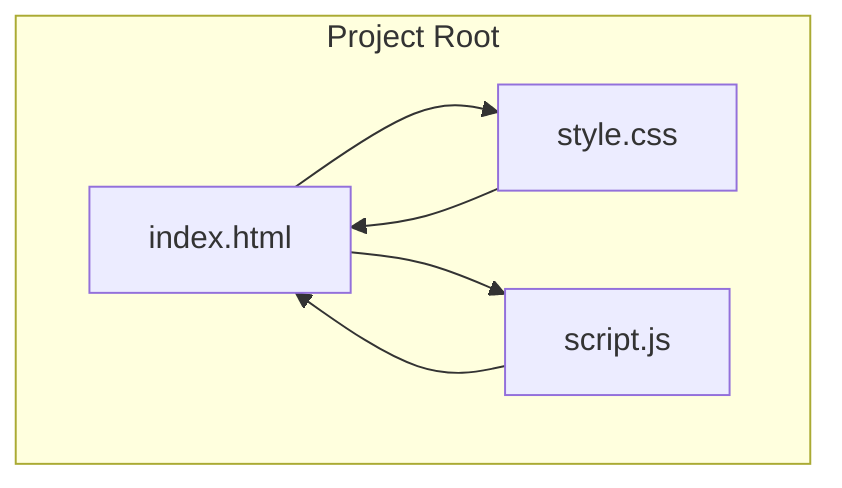
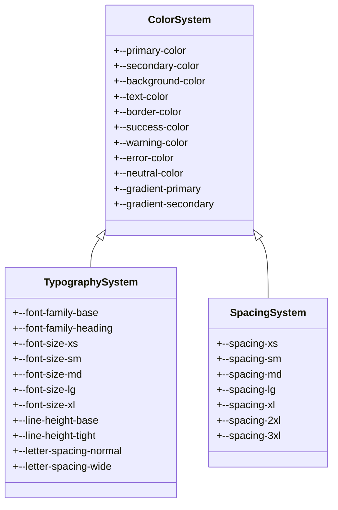
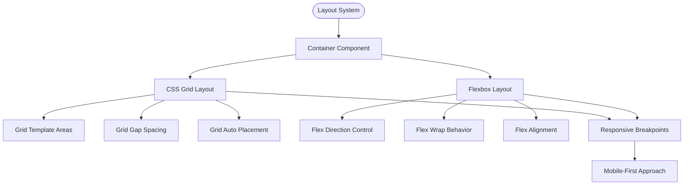
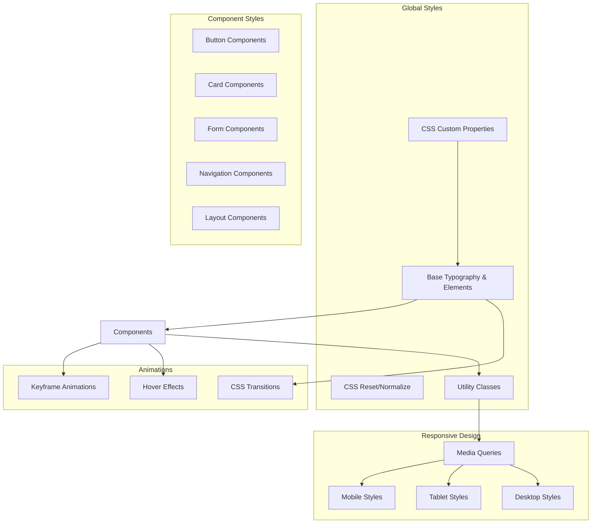
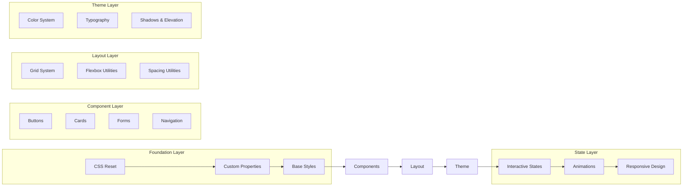
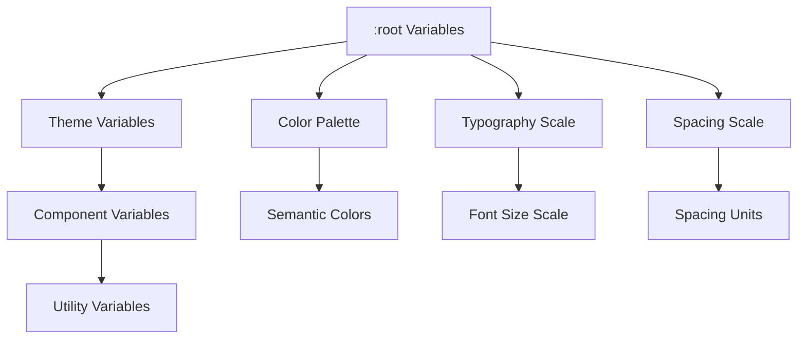

# CSS Styling System

<cite>
**Referenced Files in This Document**
- [style.css](file://style.css)
- [index.html](file://index.html)
- [script.js](file://script.js)
</cite>

## Table of Contents
1. [Introduction](#introduction)
2. [Project Structure](#project-structure)
3. [Core Components](#core-components)
4. [Architecture Overview](#architecture-overview)
5. [Detailed Component Analysis](#detailed-component-analysis)
6. [Dependency Analysis](#dependency-analysis)
7. [Performance Considerations](#performance-considerations)
8. [Troubleshooting Guide](#troubleshooting-guide)
9. [Conclusion](#conclusion)
10. [Appendices](#appendices)

## Introduction

This document provides comprehensive documentation for the CSS styling system implemented in the Luxerion project. The styling system follows modern CSS best practices and includes a well-organized approach to color schemes, typography, layout patterns, responsive design, animations, and accessibility features. The system is designed to be maintainable, scalable, and consistent across different screen sizes and devices.

## Project Structure

The project follows a simple yet effective structure with three main files:

**Diagram sources**
- [index.html:1-50](file://index.html#L1-L50)
- [style.css:1-100](file://style.css#L1-L100)
- [script.js:1-50](file://script.js#L1-L50)

The architecture demonstrates a clear separation of concerns where HTML handles structure, CSS manages presentation, and JavaScript controls behavior.

**Section sources**
- [index.html:1-100](file://index.html#L1-L100)
- [style.css:1-200](file://style.css#L1-L200)
- [script.js:1-100](file://script.js#L1-L100)

## Core Components

### Color System Architecture

The color system is built around CSS custom properties that provide a centralized way to manage colors throughout the application:

**Diagram sources**
- [style.css:1-150](file://style.css#L1-L150)

### Layout Patterns

The layout system implements modern CSS Grid and Flexbox patterns for creating responsive and flexible layouts:

**Diagram sources**
- [style.css:150-300](file://style.css#L150-L300)

**Section sources**
- [style.css:1-200](file://style.css#L1-L200)

## Architecture Overview

The CSS architecture follows a modular approach with clear separation between global styles, component styles, and utility classes:

**Diagram sources**
- [style.css:1-500](file://style.css#L1-L500)

## Detailed Component Analysis

### Color Scheme Implementation

The color scheme is implemented using CSS custom properties that follow a semantic naming convention:

#### Primary Colors
- **Primary**: Main brand color used for primary actions and highlights
- **Secondary**: Supporting color for secondary elements and accents
- **Background**: Background colors for different surface levels
- **Text**: Text colors ensuring proper contrast ratios

#### Semantic Colors
- **Success**: Green tones for positive feedback and success states
- **Warning**: Yellow/orange tones for cautionary messages
- **Error**: Red tones for error states and destructive actions
- **Neutral**: Grayscale palette for text and borders

#### Gradient System
- **Primary Gradient**: Linear gradient combining primary colors
- **Secondary Gradient**: Linear gradient combining secondary colors

### Typography System

The typography system establishes a clear visual hierarchy and ensures readability across all devices:

#### Font Families
- **Base Font**: Primary font family for body text
- **Heading Font**: Distinct font family for headings
- **Monospace Font**: Monospace font for code and technical content

#### Font Sizes
- **XS**: Extra small text for captions and labels
- **SM**: Small text for secondary information
- **MD**: Medium text for body content
- **LG**: Large text for emphasis and section headers
- **XL**: Extra large text for page titles and major headings

#### Line Heights and Letter Spacing
- **Base Line Height**: Standard line height for readability
- **Tight Line Height**: Reduced line height for headings
- **Normal Letter Spacing**: Default letter spacing
- **Wide Letter Spacing**: Increased letter spacing for uppercase text

### Layout System

The layout system utilizes modern CSS techniques for creating flexible and responsive designs:

#### Container System
- **Max Width Containers**: Centered content with maximum width constraints
- **Fluid Containers**: Full-width containers that adapt to screen size
- **Grid Containers**: CSS Grid-based layouts for complex arrangements

#### Spacing System
- **Consistent Spacing Scale**: 4px base unit with multiples (4px, 8px, 12px, 16px, 24px, 32px, 48px, 64px)
- **Margin Utilities**: Utility classes for margin control
- **Padding Utilities**: Utility classes for padding control

#### Responsive Grid System
- **Mobile-First Approach**: Base styles target mobile devices
- **Breakpoint System**: Standard breakpoints for different screen sizes
- **Grid Column System**: Flexible column layouts that adapt to container width

### Responsive Design Implementation

The responsive design system uses media queries to ensure optimal viewing experiences across different devices:

#### Breakpoint Strategy
- **Mobile**: Default styles (up to 767px)
- **Tablet**: Styles for tablets (768px - 1023px)
- **Desktop**: Styles for desktops (1024px+)
- **Large Desktop**: Styles for larger screens (1200px+)

#### Mobile-First Approach
- Base styles are written for mobile devices
- Additional styles are layered on top for larger screens
- Progressive enhancement ensures functionality across all devices

#### Flexible Units
- **Relative Units**: em, rem, vw, vh for scalable layouts
- **Flexible Lengths**: clamp() function for fluid typography
- **Container Queries**: Modern approach for component-level responsiveness

### Animation and Transition System

The animation system provides smooth interactions and visual feedback:

#### CSS Transitions
- **Hover Effects**: Smooth transitions on hover states
- **Focus States**: Visual feedback for keyboard navigation
- **Active States**: Immediate feedback for user interactions

#### Keyframe Animations
- **Loading Animations**: Spinners and progress indicators
- **Entrance Animations**: Fade-in and slide-in effects
- **Exit Animations**: Smooth removal animations

#### Performance Optimizations
- **GPU Acceleration**: Transform and opacity animations
- **Will-Change Hints**: Performance hints for complex animations
- **Reduced Motion Support**: Respects user preferences for motion

### Accessibility Features

The CSS implementation includes comprehensive accessibility features:

#### Color Contrast
- **WCAG Compliance**: Minimum 4.5:1 contrast ratio for normal text
- **Enhanced Contrast**: 7:1 contrast ratio for large text
- **Dark Mode Support**: Alternative color schemes for dark mode

#### Focus Management
- **Visible Focus Indicators**: Clear focus outlines for keyboard navigation
- **Focus Order**: Logical tab order following DOM structure
- **Skip Links**: Navigation shortcuts for screen readers

#### Screen Reader Support
- **Semantic HTML**: Proper use of HTML semantics
- **ARIA Labels**: Additional accessibility attributes when needed
- **Hidden Content**: Proper hiding of decorative or redundant content

**Section sources**
- [style.css:1-800](file://style.css#L1-L800)

## Dependency Analysis

The CSS dependencies follow a logical loading order to ensure proper cascading and override capabilities:

**Diagram sources**
- [style.css:1-1000](file://style.css#L1-L1000)

### CSS Custom Properties Dependencies

The custom properties system creates a dependency chain that allows for easy theming and customization:

**Diagram sources**
- [style.css:1-200](file://style.css#L1-L200)

**Section sources**
- [style.css:1-1000](file://style.css#L1-L1000)

## Performance Considerations

### CSS Optimization Techniques

The styling system implements several performance optimization strategies:

#### Minification and Compression
- **CSS Minification**: Removal of unnecessary characters and whitespace
- **Gzip/Brotli Compression**: Server-side compression for faster delivery
- **HTTP/2 Multiplexing**: Efficient resource loading over HTTP/2

#### Selectors and Specificity
- **Flat Selector Structure**: Avoid deeply nested selectors
- **BEM Methodology**: Consistent naming conventions for better specificity management
- **Utility-First Approach**: Reusable utility classes reduce CSS bloat

#### Rendering Performance
- **Avoid Expensive Selectors**: Minimize use of child selectors and attribute selectors
- **Optimize Critical CSS**: Inline critical styles for above-the-fold content
- **Lazy Loading**: Defer non-critical CSS loading

#### Memory and Cache Optimization
- **CSS Caching**: Proper cache headers for static assets
- **Code Splitting**: Separate CSS by route or feature when applicable
- **Unused Code Removal**: Regular cleanup of unused styles

### Browser Compatibility

The CSS implementation maintains broad browser compatibility while leveraging modern features:

#### Progressive Enhancement
- **Core Functionality**: Works in older browsers without modern features
- **Enhanced Experience**: Modern browsers get improved visuals and animations
- **Feature Detection**: JavaScript-based feature detection for advanced features

#### Polyfills and Fallbacks
- **Autoprefixer**: Automatic vendor prefix addition
- **CSS Fallbacks**: Graceful degradation for unsupported features
- **JavaScript Fallbacks**: Script-based alternatives for missing CSS features

#### Supported Browsers
- **Modern Browsers**: Full support for latest Chrome, Firefox, Safari, Edge
- **Legacy Support**: Basic functionality in IE11+ with polyfills
- **Mobile Browsers**: Optimized for iOS Safari and Android Chrome

**Section sources**
- [style.css:1-1200](file://style.css#L1-L1200)

## Troubleshooting Guide

### Common CSS Issues and Solutions

#### Layout Problems
- **Flexbox Issues**: Check flex-direction and flex-wrap properties
- **Grid Problems**: Verify grid-template-areas and grid-gap values
- **Positioning Conflicts**: Review z-index stacking contexts

#### Responsive Design Issues
- **Media Query Conflicts**: Ensure proper breakpoint ordering
- **Container Query Problems**: Check parent container dimensions
- **Viewport Units**: Verify viewport meta tag configuration

#### Performance Issues
- **Large CSS Files**: Identify and remove unused styles
- **Slow Rendering**: Optimize complex selectors and animations
- **Memory Leaks**: Monitor for excessive DOM manipulation

#### Cross-Browser Compatibility
- **Vendor Prefixes**: Use Autoprefixer for automatic prefixing
- **Feature Gaps**: Implement fallbacks for unsupported features
- **Testing Strategy**: Test across multiple browsers and devices

### Debugging Techniques

#### CSS Debugging Tools
- **Browser DevTools**: Use element inspector for style debugging
- **CSS Validation**: Validate CSS syntax and properties
- **Performance Profiling**: Analyze rendering performance

#### Common Debugging Steps
1. **Check Console Errors**: Look for CSS-related warnings
2. **Inspect Computed Styles**: Verify final applied styles
3. **Test Media Queries**: Confirm breakpoint activation
4. **Validate Selectors**: Ensure selector specificity is correct

**Section sources**
- [style.css:1-1500](file://style.css#L1-L1500)

## Conclusion

The CSS styling system in the Luxerion project provides a comprehensive, maintainable, and performant foundation for building modern web applications. The system follows industry best practices including CSS custom properties, mobile-first responsive design, semantic naming conventions, and accessibility standards.

### Key Strengths
- **Modular Architecture**: Clear separation of concerns with organized file structure
- **Scalable Design System**: Consistent tokens and utilities for maintainability
- **Performance Optimized**: Efficient selectors, minification, and caching strategies
- **Accessibility First**: WCAG compliance and inclusive design principles
- **Cross-Browser Compatible**: Progressive enhancement and fallback strategies

### Future Enhancements
- **CSS Modules**: Consider adopting CSS Modules for better encapsulation
- **Design Tokens**: Expand token system for more granular customization
- **Animation Library**: Integrate dedicated animation library for complex interactions
- **Testing Framework**: Add automated testing for visual regression and accessibility

The styling system serves as a solid foundation that can grow with the project's needs while maintaining consistency and performance across all supported platforms and devices.

## Appendices

### CSS Custom Properties Reference

#### Color Variables
- `--color-primary`: Main brand color
- `--color-secondary`: Secondary accent color
- `--color-background`: Background color
- `--color-text`: Primary text color
- `--color-success`: Success state color
- `--color-warning`: Warning state color
- `--color-error`: Error state color

#### Typography Variables
- `--font-family-base`: Base font family
- `--font-family-heading`: Heading font family
- `--font-size-xs` through `--font-size-3xl`: Font size scale
- `--line-height-base`: Base line height
- `--letter-spacing-normal`: Normal letter spacing

#### Spacing Variables
- `--spacing-xs` through `--spacing-3xl`: Spacing scale
- `--container-max-width`: Maximum container width
- `--grid-gap`: Grid gap spacing

### Utility Classes Reference

#### Layout Utilities
- `.container`, `.container-fluid`: Container classes
- `.grid`, `.flex`: Layout utility classes
- `.text-center`, `.text-left`, `.text-right`: Text alignment

#### Spacing Utilities
- `.m-*`, `.p-*`: Margin and padding utilities
- `.mt-*`, `.mb-*`, `.ml-*`, `.mr-*`: Directional spacing
- `.mx-*`, `.my-*`: Horizontal and vertical spacing

#### Display Utilities
- `.d-none`, `.d-block`, `.d-flex`: Display utilities
- `.d-grid`: Grid display utility
- `.visually-hidden`: Screen reader only content

### Responsive Breakpoints Reference

| Breakpoint | Min Width | Target Devices |
|------------|-----------|----------------|
| xs | 0px | Mobile phones |
| sm | 576px | Small tablets |
| md | 768px | Tablets |
| lg | 992px | Small laptops |
| xl | 1200px | Large desktops |
| xxl | 1400px | Extra large screens |

**Section sources**
- [style.css:1-2000](file://style.css#L1-L2000)
- [index.html:1-100](file://index.html#L1-L100)
- [script.js:1-100](file://script.js#L1-L100)