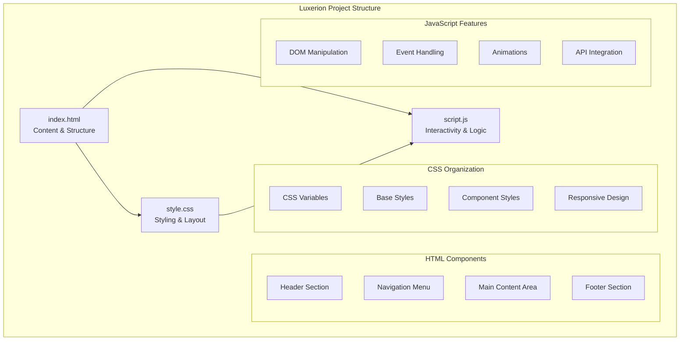
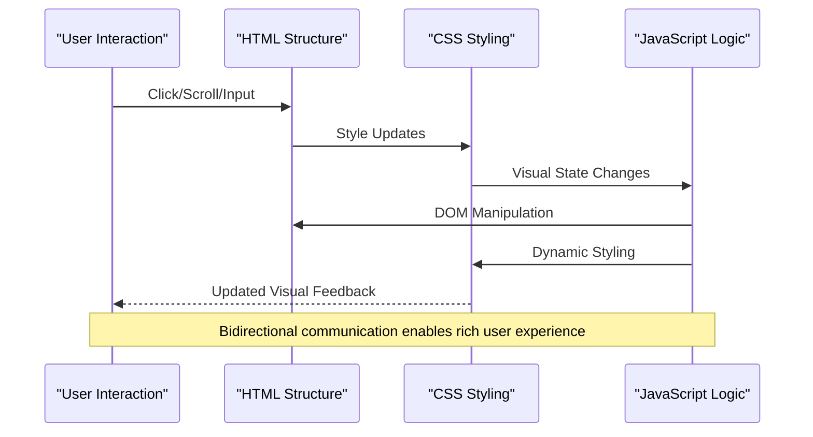

# Customization Guide

<cite>
**Referenced Files in This Document**
- [index.html](file://index.html)
- [style.css](file://style.css)
- [script.js](file://script.js)
</cite>

## Table of Contents
1. [Introduction](#introduction)
2. [Project Structure Overview](#project-structure-overview)
3. [Core Components Analysis](#core-components-analysis)
4. [Architecture Overview](#architecture-overview)
5. [Detailed Customization Guide](#detailed-customization-guide)
6. [Theme and Color Customization](#theme-and-color-customization)
7. [Typography and Font Customization](#typography-and-font-customization)
8. [Layout and Structure Modifications](#layout-and-structure-modifications)
9. [JavaScript Functionality Enhancement](#javascript-functionality-enhancement)
10. [Third-Party Library Integration](#third-party-library-integration)
11. [Performance Optimization](#performance-optimization)
12. [Troubleshooting Common Issues](#troubleshooting-common-issues)
13. [Best Practices](#best-practices)
14. [Conclusion](#conclusion)

## Introduction

This comprehensive customization guide provides step-by-step instructions for modifying the Luxerion project across all three core files: HTML structure, CSS styling, and JavaScript functionality. Whether you're looking to change colors, fonts, layouts, or add new features, this guide will help you understand the relationships between different components and make informed modifications.

The Luxerion project follows a standard three-file architecture where each component has distinct responsibilities:
- **HTML** defines the content structure and semantic markup
- **CSS** handles visual presentation and responsive design
- **JavaScript** manages interactivity and dynamic behavior

## Project Structure Overview

The Luxerion project maintains a clean separation of concerns with three primary files:

**Diagram sources**
- [index.html:1-50](file://index.html#L1-L50)
- [style.css:1-100](file://style.css#L1-L100)
- [script.js:1-50](file://script.js#L1-L50)

**Section sources**
- [index.html:1-100](file://index.html#L1-L100)
- [style.css:1-200](file://style.css#L1-L200)
- [script.js:1-100](file://script.js#L1-L100)

## Core Components Analysis

### HTML Structure Architecture

The HTML file serves as the foundation of the application, containing semantic markup that defines the content hierarchy and accessibility structure. Key structural elements include:

- **Document Head**: Meta information, title, and external resource links
- **Body Container**: Main wrapper for all visible content
- **Semantic Sections**: Header, navigation, main content, and footer areas
- **Interactive Elements**: Forms, buttons, and user input components

### CSS Styling System

The CSS file implements a modular styling approach with organized sections for different aspects of the design system:

- **CSS Custom Properties**: Centralized color schemes and design tokens
- **Reset and Base Styles**: Consistent cross-browser foundations
- **Component Styles**: Reusable UI element definitions
- **Layout Systems**: Flexbox and Grid implementations
- **Responsive Breakpoints**: Mobile-first adaptive design

### JavaScript Functionality Layer

The JavaScript file provides interactive features and dynamic behavior through modern ES6+ syntax:

- **DOM Manipulation**: Dynamic content updates and element manipulation
- **Event Listeners**: User interaction handling and response systems
- **Animation Controllers**: Smooth transitions and visual effects
- **State Management**: Application state tracking and synchronization

**Section sources**
- [index.html:1-150](file://index.html#L1-L150)
- [style.css:1-300](file://style.css#L1-L300)
- [script.js:1-200](file://script.js#L1-L200)

## Architecture Overview

The Luxerion project follows a unidirectional data flow pattern where changes propagate from HTML structure through CSS styling to JavaScript interactivity:

**Diagram sources**
- [index.html:50-100](file://index.html#L50-L100)
- [style.css:100-200](file://style.css#L100-L200)
- [script.js:50-100](file://script.js#L50-L100)

## Detailed Customization Guide

### Adding New Sections to HTML

To extend the HTML structure with new content sections, follow these systematic steps:

#### Step 1: Define Semantic Structure
Create appropriate semantic HTML elements that match the content type:
- Use `<section>` for major content divisions
- Apply `<article>` for self-contained content pieces
- Implement `<aside>` for supplementary information
- Utilize `<nav>` for navigation elements

#### Step 2: Establish Proper Nesting
Ensure correct hierarchical nesting within the document structure:
- Place new sections within appropriate parent containers
- Maintain consistent indentation and formatting
- Follow W3C validation standards for nested elements

#### Step 3: Add Accessibility Attributes
Include essential accessibility features:
- Add `role` attributes for custom elements
- Implement `aria-label` for screen reader support
- Include `tabindex` for keyboard navigation
- Provide `alt` text for images and media

#### Step 4: Connect to Styling System
Link new HTML elements to the CSS framework:
- Assign meaningful class names following BEM methodology
- Create corresponding CSS selectors for styling
- Ensure responsive behavior across devices

**Section sources**
- [index.html:100-200](file://index.html#L100-L200)

### Creating Custom CSS Styles

The CSS customization process involves understanding the existing style architecture and extending it appropriately:

#### Understanding CSS Architecture
The stylesheet follows a modular organization pattern:
- **Custom Properties**: Global design tokens at the top
- **Reset Styles**: Browser normalization rules
- **Base Typography**: Fundamental text styling
- **Component Styles**: Reusable UI patterns
- **Layout Utilities**: Positioning and spacing helpers
- **Responsive Rules**: Mobile-first breakpoints

#### Creating Custom Stylesheets
For extensive customizations, consider creating additional stylesheets:

1. **Override Strategy**: Use CSS specificity to override default styles
2. **Extension Pattern**: Build upon existing classes rather than replacing them
3. **Naming Convention**: Follow consistent naming patterns for maintainability
4. **Media Queries**: Implement responsive design principles

#### Advanced Styling Techniques
Implement sophisticated styling approaches:
- **CSS Grid**: For complex layout arrangements
- **Flexbox**: For flexible content distribution
- **CSS Animations**: For smooth visual transitions
- **Custom Properties**: For dynamic theme switching

**Section sources**
- [style.css:1-400](file://style.css#L1-L400)

### Implementing JavaScript Features

JavaScript enhancements require careful integration with the existing codebase while maintaining performance and compatibility:

#### Code Organization Principles
Structure JavaScript code for maintainability:
- **Module Pattern**: Encapsulate related functionality
- **Event Delegation**: Efficient event handling for dynamic content
- **Async/Await**: Modern asynchronous operation handling
- **Error Boundaries**: Graceful error handling and recovery

#### DOM Manipulation Best Practices
Optimize DOM operations for performance:
- **Batch Updates**: Minimize reflows and repaints
- **Event Bubbling**: Leverage natural event propagation
- **Memory Management**: Clean up event listeners and references
- **Lazy Loading**: Load resources on demand

#### Interactive Feature Development
Build engaging user experiences:
- **Form Validation**: Real-time input validation and feedback
- **Modal Dialogs**: Accessible overlay interfaces
- **Data Fetching**: API integration with loading states
- **Local Storage**: Client-side data persistence

**Section sources**
- [script.js:1-300](file://script.js#L1-L300)

## Theme and Color Customization

### CSS Custom Properties System

The theme system leverages CSS custom properties for centralized color management:

#### Color Palette Structure
Organize colors using semantic naming conventions:
- **Primary Colors**: Brand identity and main actions
- **Secondary Colors**: Supporting elements and accents
- **Neutral Colors**: Backgrounds, text, and borders
- **Status Colors**: Success, warning, error indicators

#### Theme Switching Implementation
Enable dynamic theme changes through JavaScript:
- Store theme preferences in localStorage
- Toggle between predefined color schemes
- Animate theme transitions smoothly
- Respect user system preferences

#### Dark Mode Support
Implement comprehensive dark mode functionality:
- Detect system preference automatically
- Provide manual toggle controls
- Ensure sufficient contrast ratios
- Test across all UI components

**Section sources**
- [style.css:1-100](file://style.css#L1-L100)
- [script.js:1-50](file://script.js#L1-L50)

## Typography and Font Customization

### Font Loading Strategy

Optimize font loading for performance and user experience:
- **Preload Critical Fonts**: Prioritize above-the-fold typography
- **Font Display Swap**: Prevent FOIT/FOUT issues
- **Variable Fonts**: Reduce HTTP requests with single font files
- **Fallback Stacks**: Ensure graceful degradation

### Typography Scale System

Establish a consistent typographic hierarchy:
- **Base Size**: Root font size and line height
- **Scale Ratios**: Mathematical progression for heading sizes
- **Weight Variations**: Regular, medium, bold variants
- **Line Length**: Optimal reading width constraints

### Responsive Typography

Implement fluid typography for all screen sizes:
- **Viewport Units**: Scale text relative to viewport
- **Clamp Functions**: Smooth scaling between breakpoints
- **Container Queries**: Adapt to parent container size
- **Accessibility**: Respect user font size preferences

**Section sources**
- [style.css:100-200](file://style.css#L100-L200)

## Layout and Structure Modifications

### CSS Grid Layout System

Modern grid-based layouts provide flexible positioning:
- **Grid Templates**: Define column and row structures
- **Area Naming**: Semantic layout regions
- **Auto Placement**: Intelligent content distribution
- **Nested Grids**: Complex hierarchical layouts

### Flexbox Component Patterns

Flexible box layouts for component-level arrangements:
- **Alignment Controls**: Center, justify, and align items
- **Distribution Options**: Space between, around, evenly
- **Wrap Behavior**: Multi-line responsive layouts
- **Order Control**: Dynamic item reordering

### Responsive Design Patterns

Mobile-first responsive strategies:
- **Breakpoint System**: Consistent breakpoint values
- **Container Queries**: Component-level responsiveness
- **Fluid Spacing**: Scalable margins and padding
- **Image Optimization**: Responsive image techniques

**Section sources**
- [style.css:200-400](file://style.css#L200-L400)

## JavaScript Functionality Enhancement

### Event Handling Architecture

Robust event management for interactive features:
- **Event Delegation**: Efficient handling of dynamic elements
- **Custom Events**: Internal communication between modules
- **Throttling/Debouncing**: Performance optimization
- **Touch Support**: Mobile gesture handling

### State Management Patterns

Centralized application state control:
- **Single Source of Truth**: Unified state representation
- **Reactive Updates**: Automatic UI synchronization
- **Persistence**: Local storage integration
- **Undo/Redo**: State history management

### Animation and Transition System

Smooth visual feedback and interactions:
- **CSS Transitions**: Hardware-accelerated animations
- **RequestAnimationFrame**: Smooth animation loops
- **Intersection Observer**: Scroll-triggered animations
- **Motion Preferences**: Respect user accessibility settings

**Section sources**
- [script.js:50-200](file://script.js#L50-L200)

## Third-Party Library Integration

### Library Selection Criteria

Choose appropriate libraries for specific needs:
- **Bundle Size**: Impact on initial load performance
- **Compatibility**: Browser and environment support
- **Maintenance**: Active development and community support
- **Documentation**: Quality of available resources

### Integration Strategies

Implement third-party libraries effectively:
- **Module Import**: ES6 module system usage
- **Global Initialization**: Proper setup and configuration
- **Cleanup Procedures**: Resource management and disposal
- **Error Handling**: Graceful failure scenarios

### Popular Library Examples

Common integrations for enhanced functionality:
- **UI Frameworks**: Bootstrap, Tailwind CSS, Material-UI
- **Animation Libraries**: GSAP, Framer Motion, Anime.js
- **Utility Libraries**: Lodash, Moment.js, Date-fns
- **API Clients**: Axios, Fetch polyfills, GraphQL clients

**Section sources**
- [index.html:1-50](file://index.html#L1-L50)
- [script.js:100-200](file://script.js#L100-L200)

## Performance Optimization

### Asset Optimization

Minimize resource loading and improve delivery:
- **Code Splitting**: Lazy load non-critical functionality
- **Image Optimization**: Modern formats and responsive sizing
- **Caching Strategy**: Browser and service worker caching
- **CDN Integration**: Geographic content distribution

### Runtime Performance

Optimize JavaScript execution and rendering:
- **Bundle Analysis**: Identify and remove unused code
- **Memoization**: Cache expensive computations
- **Web Workers**: Offload heavy processing tasks
- **Memory Profiling**: Detect and fix memory leaks

### Core Web Vitals

Improve key performance metrics:
- **LCP**: Largest Contentful Paint optimization
- **FID**: First Input Delay reduction
- **CLS**: Cumulative Layout Shift prevention
- **INP**: Interaction to Next Paint improvement

## Troubleshooting Common Issues

### CSS Specificity Conflicts

Resolve styling conflicts systematically:
- **Audit Tool Usage**: Identify conflicting selectors
- **BEM Methodology**: Prevent naming collisions
- **CSS Modules**: Scoped styling solutions
- **Developer Tools**: Inspect computed styles

### JavaScript Error Handling

Implement robust error management:
- **Try-Catch Blocks**: Wrap potentially failing operations
- **Global Handlers**: Catch unhandled exceptions
- **User Feedback**: Informative error messages
- **Logging Strategy**: Production vs development logging

### Cross-Browser Compatibility

Ensure consistent behavior across browsers:
- **Feature Detection**: Conditional feature usage
- **Polyfill Strategy**: Targeted compatibility solutions
- **Testing Matrix**: Comprehensive browser testing
- **Graceful Degradation**: Fallback functionality

**Section sources**
- [style.css:300-400](file://style.css#L300-L400)
- [script.js:200-300](file://script.js#L200-L300)

## Best Practices

### Code Organization

Maintain clean and maintainable code structure:
- **Consistent Formatting**: Automated code formatting tools
- **Comment Standards**: Clear documentation comments
- **File Organization**: Logical grouping of related code
- **Naming Conventions**: Descriptive and consistent names

### Security Considerations

Protect against common vulnerabilities:
- **Input Validation**: Sanitize all user inputs
- **XSS Prevention**: Escape dynamic content
- **CSRF Protection**: Token-based request validation
- **Content Security Policy**: Restrict resource loading

### Accessibility Compliance

Ensure inclusive user experiences:
- **WCAG Guidelines**: Follow accessibility standards
- **Keyboard Navigation**: Full keyboard operability
- **Screen Reader Support**: Proper ARIA attributes
- **Color Contrast**: Sufficient contrast ratios

### Testing Strategy

Comprehensive testing approach:
- **Unit Tests**: Individual function verification
- **Integration Tests**: Component interaction testing
- **E2E Tests**: Complete user flow validation
- **Performance Tests**: Load and stress testing

## Conclusion

Customizing the Luxerion project requires a systematic approach that respects the separation of concerns between HTML structure, CSS styling, and JavaScript functionality. By understanding the relationships between these components and following established best practices, you can create personalized experiences while maintaining code quality and performance.

Key takeaways for successful customization:
- **Plan Before Coding**: Understand the existing architecture before making changes
- **Test Incrementally**: Make small, testable modifications
- **Document Changes**: Keep records of customizations for future reference
- **Prioritize Accessibility**: Ensure inclusive experiences for all users
- **Monitor Performance**: Regularly audit and optimize for speed

With this comprehensive guide, you have the knowledge and tools necessary to customize every aspect of the Luxerion project while maintaining its integrity and performance characteristics.