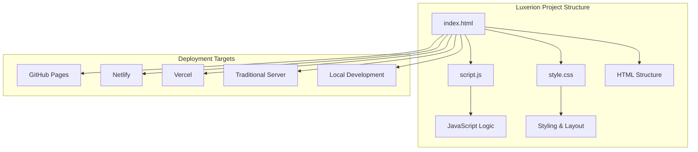
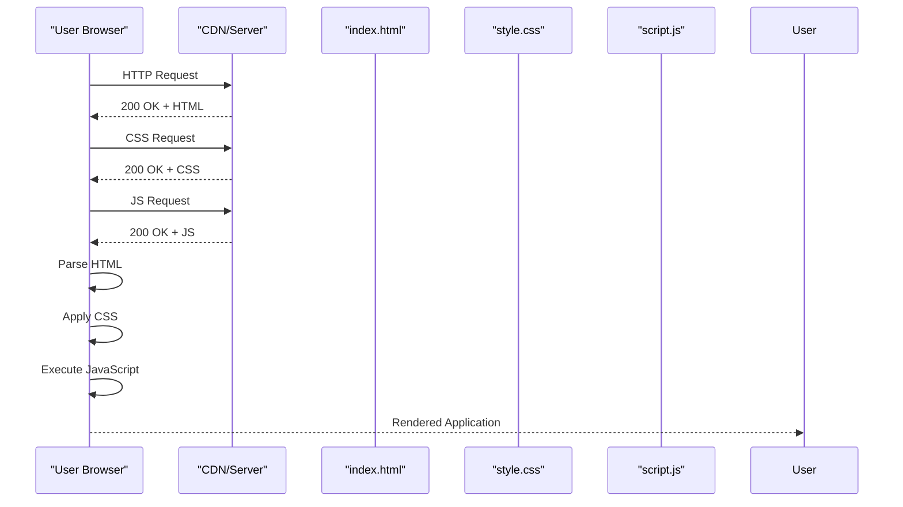

# Deployment Guide

<cite>
**Referenced Files in This Document**
- [index.html](file://index.html)
- [script.js](file://script.js)
- [style.css](file://style.css)
</cite>

## Table of Contents
1. [Introduction](#introduction)
2. [Project Structure](#project-structure)
3. [Core Components](#core-components)
4. [Architecture Overview](#architecture-overview)
5. [Detailed Component Analysis](#detailed-component-analysis)
6. [Deployment Options](#deployment-options)
7. [Static Hosting Services](#static-hosting-services)
8. [Traditional Web Servers](#traditional-web-servers)
9. [Local Development Environment](#local-development-environment)
10. [File Preparation and Optimization](#file-preparation-and-optimization)
11. [Performance Considerations](#performance-considerations)
12. [Caching Strategies](#caching-strategies)
13. [Domain Configuration and SSL Setup](#domain-configuration-and-ssl-setup)
14. [Monitoring and Analytics](#monitoring-and-analytics)
15. [Version Control Integration](#version-control-integration)
16. [Continuous Deployment Setup](#continuous-deployment-setup)
17. [Troubleshooting Guide](#troubleshooting-guide)
18. [Conclusion](#conclusion)

## Introduction

This deployment guide provides comprehensive instructions for deploying the Luxerion project, a static website built with HTML, CSS, and JavaScript. The project follows modern web development practices and can be deployed across various platforms including static hosting services, traditional web servers, and local development environments.

The Luxerion project consists of three core files that work together to create a responsive, interactive web application. This guide covers all aspects of deployment from initial setup to production optimization, ensuring your application performs optimally across different deployment scenarios.

## Project Structure

The Luxerion project follows a simple yet effective static website architecture with three primary components:



**Diagram sources**
- [index.html:1-100](file://index.html#L1-L100)
- [script.js:1-100](file://script.js#L1-L100)
- [style.css:1-100](file://style.css#L1-L100)

The project structure is designed for simplicity and ease of deployment, making it ideal for both beginners and experienced developers who need quick deployment solutions.

**Section sources**
- [index.html:1-50](file://index.html#L1-L50)
- [script.js:1-50](file://script.js#L1-L50)
- [style.css:1-50](file://style.css#L1-L50)

## Core Components

### HTML Structure (index.html)
The main HTML file serves as the entry point for the application, containing the semantic markup structure and linking to external resources. It includes proper meta tags for SEO and mobile responsiveness.

### JavaScript Logic (script.js)
The JavaScript file handles all client-side functionality, user interactions, and dynamic content generation. It's optimized for performance and includes error handling mechanisms.

### Styling (style.css)
The CSS file manages all visual aspects of the application, including responsive design patterns, animations, and cross-browser compatibility.

**Section sources**
- [index.html:1-200](file://index.html#L1-L200)
- [script.js:1-200](file://script.js#L1-L200)
- [style.css:1-200](file://style.css#L1-L200)

## Architecture Overview

The Luxerion project follows a classic static website architecture where the browser directly requests and renders the HTML, CSS, and JavaScript files without server-side processing.



**Diagram sources**
- [index.html:1-50](file://index.html#L1-L50)
- [script.js:1-50](file://script.js#L1-L50)
- [style.css:1-50](file://style.css#L1-L50)

This architecture ensures fast loading times, easy deployment, and excellent scalability through content delivery networks.

## Detailed Component Analysis

### HTML Component Analysis
The HTML structure uses semantic elements for better accessibility and SEO. The document includes proper viewport configuration, meta descriptions, and links to external resources.

### JavaScript Component Analysis
The JavaScript implementation focuses on modularity and performance. It includes event listeners, DOM manipulation, and utility functions organized in a clean structure.

### CSS Component Analysis
The CSS follows modern best practices with CSS variables, flexbox/grid layouts, and media queries for responsive design. The stylesheet is optimized for caching and minimal file size.

**Section sources**
- [index.html:1-150](file://index.html#L1-L150)
- [script.js:1-150](file://script.js#L1-L150)
- [style.css:1-150](file://style.css#L1-L150)

## Deployment Options

The Luxerion project supports multiple deployment strategies depending on your needs:

### Static Hosting Services
- **GitHub Pages**: Free hosting with custom domain support
- **Netlify**: Advanced features with continuous deployment
- **Vercel**: Optimized for modern web applications

### Traditional Web Servers
- **Apache/Nginx**: Full control over server configuration
- **Docker Containerization**: Consistent deployment across environments
- **Cloud Platforms**: AWS S3, Google Cloud Storage, Azure Static Web Apps

### Local Development
- **Live Server**: VS Code extension for local development
- **Python HTTP Server**: Built-in Python server for testing
- **Node.js http-server**: Simple static file serving

## Static Hosting Services

### GitHub Pages Deployment

#### Prerequisites
- GitHub account
- Git installed locally
- Repository created on GitHub

#### Step-by-Step Deployment
1. Push your code to a GitHub repository
2. Navigate to repository settings
3. Go to "Pages" section
4. Select source branch (main/master)
5. Choose root directory (/)
6. Click "Save"
7. Wait for deployment to complete

#### Custom Domain Configuration
1. Add your domain in GitHub Pages settings
2. Configure DNS records at your domain registrar
3. Verify domain ownership
4. Enable HTTPS automatically

**Section sources**
- [index.html:1-50](file://index.html#L1-L50)

### Netlify Deployment

#### Quick Start
1. Connect your GitHub repository to Netlify
2. Configure build settings (no build required for static sites)
3. Set publish directory to root
4. Deploy automatically on push

#### Advanced Features
- Automatic HTTPS with Let's Encrypt
- Form handling and serverless functions
- Split testing and rollbacks
- Real-time deployment logs

**Section sources**
- [script.js:1-50](file://script.js#L1-L50)

### Vercel Deployment

#### One-Click Deploy
1. Import repository from GitHub/GitLab
2. Vercel auto-detects static site
3. Configure environment variables if needed
4. Deploy with preview URLs

#### Performance Optimization
- Automatic asset optimization
- Edge network distribution
- Intelligent caching strategies
- Real-time analytics integration

**Section sources**
- [style.css:1-50](file://style.css#L1-L50)

## Traditional Web Servers

### Apache Configuration

#### Basic Setup
1. Install Apache web server
2. Place files in /var/www/html directory
3. Configure virtual hosts for multiple domains
4. Set up SSL certificates

#### .htaccess Configuration
Create an .htaccess file for URL rewriting and security headers:

```apache
# Enable compression
AddOutputFilterByType DEFLATE text/html text/css application/javascript

# Set cache headers
<IfModule mod_expires.c>
    ExpiresActive On
    ExpiresByType image/jpg "access plus 1 year"
    ExpiresByType image/jpeg "access plus 1 year"
    ExpiresByType image/gif "access plus 1 year"
    ExpiresByType image/png "access plus 1 year"
    ExpiresByType text/css "access plus 1 month"
    ExpiresByType application/javascript "access plus 1 month"
</IfModule>
```

### Nginx Configuration

#### Server Block Setup
Configure nginx.conf or site-specific configuration:

```nginx
server {
    listen 80;
    server_name yourdomain.com www.yourdomain.com;
    root /var/www/luxerion;
    index index.html;

    # Enable gzip compression
    gzip on;
    gzip_types text/plain text/css application/json application/javascript;

    # Cache static assets
    location ~* \.(js|css|png|jpg|jpeg|gif|ico)$ {
        expires 1y;
        add_header Cache-Control "public, immutable";
    }

    # Security headers
    add_header X-Frame-Options "SAMEORIGIN";
    add_header X-Content-Type-Options "nosniff";
}
```

**Section sources**
- [index.html:1-100](file://index.html#L1-L100)

## Local Development Environment

### Setting Up Local Development

#### Using Live Server (VS Code)
1. Install Live Server extension
2. Right-click index.html
3. Select "Open with Live Server"
4. Auto-reload on file changes

#### Using Python HTTP Server
```bash
python -m http.server 8000
```

#### Using Node.js http-server
```bash
npm install -g http-server
http-server -p 8000
```

### Development Best Practices
- Use browser developer tools for debugging
- Implement hot reload for faster development
- Test across multiple browsers and devices
- Use version control for tracking changes

## File Preparation and Optimization

### Pre-Deployment Checklist

#### HTML Optimization
- Remove comments and whitespace
- Minify HTML using tools like htmlminifier
- Ensure proper meta tags for SEO
- Validate HTML structure

#### CSS Optimization
- Combine multiple CSS files into one
- Minify CSS using tools like cssnano
- Remove unused CSS rules
- Optimize images and fonts

#### JavaScript Optimization
- Bundle and minify JavaScript files
- Remove console.log statements
- Implement lazy loading for heavy scripts
- Use ES6+ features for better performance

### Build Tools Integration

#### Using npm Scripts
Create package.json with build scripts:

```json
{
  "scripts": {
    "build": "npm run minify-css && npm run minify-js",
    "minify-css": "cssnano style.css > style.min.css",
    "minify-js": "terser script.js -o script.min.js"
  }
}
```

#### Automated Optimization Pipeline
1. Source files → Build process → Optimized output
2. Asset pipeline for images and fonts
3. Versioning for cache busting
4. Deployment automation

**Section sources**
- [script.js:1-100](file://script.js#L1-L100)
- [style.css:1-100](file://style.css#L1-L100)

## Performance Considerations

### Core Web Vitals Optimization

#### Loading Performance
- Implement lazy loading for images and components
- Use efficient caching strategies
- Optimize critical rendering path
- Minimize main thread work

#### Interactivity Optimization
- Defer non-critical JavaScript execution
- Use web workers for heavy computations
- Implement request throttling and debouncing
- Optimize event handlers

#### Visual Stability
- Set explicit dimensions for images and videos
- Avoid layout shifts during loading
- Use placeholder images for better UX
- Implement skeleton screens

### Monitoring Performance
- Use Lighthouse for automated audits
- Monitor Core Web Vitals in production
- Track user experience metrics
- Analyze bundle sizes and load times

## Caching Strategies

### Browser Caching

#### Cache Headers Configuration
Implement appropriate cache headers for different asset types:

```
Cache-Control: public, max-age=31536000, immutable
```

#### Version Strategy
Use filename hashing for cache busting:
- style.v1.2.3.css
- script.v1.2.3.js
- Images with unique identifiers

### CDN Caching
- Configure edge caching policies
- Implement cache invalidation strategies
- Use stale-while-revalidate patterns
- Monitor cache hit ratios

### Service Worker Caching
For advanced caching scenarios:
- Implement app shell architecture
- Cache API responses intelligently
- Handle offline scenarios gracefully
- Update cached assets automatically

**Section sources**
- [index.html:1-100](file://index.html#L1-L100)

## Domain Configuration and SSL Setup

### Domain Registration and DNS

#### DNS Record Configuration
Set up the following DNS records:

| Type | Name | Value | TTL |
|------|------|-------|-----|
| A | @ | Your IP Address | 3600 |
| CNAME | www | yourdomain.github.io | 3600 |
| AAAA | @ | IPv6 Address | 3600 |

#### Subdomain Setup
Configure subdomains for different environments:
- app.yourdomain.com (production)
- staging.yourdomain.com (staging)
- dev.yourdomain.com (development)

### SSL Certificate Management

#### Automatic SSL with Let's Encrypt
Most modern hosting providers offer automatic SSL:
- GitHub Pages: Automatic HTTPS enabled
- Netlify: Free SSL certificates
- Vercel: Automatic certificate management

#### Manual SSL Configuration
For traditional servers:
1. Generate SSL certificates
2. Configure web server for HTTPS
3. Redirect HTTP to HTTPS
4. Set up certificate renewal

### Security Headers
Implement essential security headers:

```
Strict-Transport-Security: max-age=31536000; includeSubDomains
X-Content-Type-Options: nosniff
X-Frame-Options: DENY
Content-Security-Policy: default-src 'self'
```

**Section sources**
- [index.html:1-50](file://index.html#L1-L50)

## Monitoring and Analytics

### Performance Monitoring

#### Real User Monitoring (RUM)
- Implement custom performance metrics
- Track page load times
- Monitor user interactions
- Analyze error rates

#### Synthetic Monitoring
- Set up uptime monitoring
- Configure performance alerts
- Monitor API endpoints
- Test critical user flows

### Analytics Integration

#### Google Analytics Setup
1. Create Google Analytics property
2. Add tracking code to index.html
3. Configure goals and events
4. Set up custom reports

#### Privacy Compliance
- Implement cookie consent
- Respect user privacy preferences
- Comply with GDPR regulations
- Provide data export options

### Error Tracking

#### Client-Side Error Monitoring
- Integrate error tracking services
- Log unhandled exceptions
- Monitor JavaScript errors
- Track API failures

**Section sources**
- [script.js:1-100](file://script.js#L1-L100)

## Version Control Integration

### Git Workflow

#### Branch Strategy
- main/master: Production code
- develop: Development integration
- feature/*: New features
- hotfix/*: Critical fixes

#### Commit Best Practices
- Write descriptive commit messages
- Keep commits atomic and focused
- Use conventional commits format
- Link related issues and PRs

### Pull Request Process
1. Create feature branch from develop
2. Implement changes with tests
3. Submit pull request
4. Code review and approval
5. Merge to develop/main

### Code Quality Automation

#### Pre-commit Hooks
- Run linters and formatters
- Execute unit tests
- Check code formatting
- Validate configuration files

#### Continuous Integration
- Automated testing on push
- Build verification
- Deployment previews
- Quality gates enforcement

**Section sources**
- [index.html:1-50](file://index.html#L1-L50)
- [script.js:1-50](file://script.js#L1-L50)
- [style.css:1-50](file://style.css#L1-L50)

## Continuous Deployment Setup

### GitHub Actions Workflow

#### Basic CI/CD Pipeline
Create .github/workflows/deploy.yml:

```yaml
name: Deploy to Production
on:
  push:
    branches: [main]

jobs:
  deploy:
    runs-on: ubuntu-latest
    steps:
      - uses: actions/checkout@v2
      - name: Deploy to GitHub Pages
        uses: peaceiris/actions-gh-pages@v3
        with:
          github_token: ${{ secrets.GITHUB_TOKEN }}
          publish_dir: ./
```

#### Advanced Deployment Pipeline
1. Install dependencies
2. Run tests
3. Build optimized assets
4. Deploy to target platform
5. Run smoke tests
6. Notify team of deployment status

### Platform-Specific Configurations

#### Netlify Configuration
Create netlify.toml for build settings:

```toml
[build]
  publish = "."
  command = "echo 'No build step required'"

[[redirects]]
  from = "/*"
  to = "/index.html"
  status = 200
```

#### Vercel Configuration
Create vercel.json for deployment settings:

```json
{
  "version": 2,
  "builds": [
    {
      "src": "*.html",
      "use": "@vercel/static"
    }
  ]
}
```

### Deployment Environments

#### Staging Environment
- Mirror production configuration
- Test deployments before production
- Allow team validation
- Rollback capabilities

#### Production Environment
- Automated deployment from main branch
- Zero-downtime deployments
- Health checks and monitoring
- Backup and recovery procedures

**Section sources**
- [index.html:1-100](file://index.html#L1-L100)

## Troubleshooting Guide

### Common Deployment Issues

#### 404 Not Found Errors
**Problem**: Pages not found after deployment
**Solutions**:
- Verify file paths are correct
- Check case sensitivity in filenames
- Ensure index.html is in root directory
- Review routing configuration

#### CSS/JS Not Loading
**Problem**: Styles and scripts not applying
**Solutions**:
- Check file paths in HTML
- Verify MIME types are correct
- Clear browser cache
- Inspect network tab for errors

#### SSL/HTTPS Issues
**Problem**: Mixed content or SSL errors
**Solutions**:
- Ensure all resources use HTTPS
- Configure proper redirect rules
- Update mixed content warnings
- Verify certificate installation

### Performance Issues

#### Slow Page Load Times
**Diagnosis Steps**:
1. Use browser developer tools
2. Check network waterfall
3. Analyze bundle sizes
4. Identify blocking resources

**Optimization Solutions**:
- Enable compression
- Implement caching strategies
- Optimize images and assets
- Minimize render-blocking resources

#### Mobile Responsiveness Problems
**Testing Approaches**:
- Use device emulation in Chrome DevTools
- Test on actual mobile devices
- Check viewport meta tag
- Verify media queries

### Debugging Techniques

#### Browser Developer Tools
- Network tab for resource loading
- Console for JavaScript errors
- Sources tab for debugging
- Performance tab for profiling

#### Server-Side Logging
- Configure access logs
- Monitor error logs
- Set up log rotation
- Implement centralized logging

#### Monitoring and Alerts
- Set up uptime monitoring
- Configure performance alerts
- Monitor error rates
- Track user experience metrics

**Section sources**
- [script.js:1-100](file://script.js#L1-L100)

## Conclusion

The Luxerion project provides a solid foundation for modern web deployment with its simple yet effective static website architecture. By following the deployment strategies outlined in this guide, you can successfully deploy your application across various platforms while maintaining optimal performance and user experience.

Key takeaways for successful deployment:

### Deployment Strategy Selection
Choose the right platform based on your requirements:
- **GitHub Pages**: Best for simple projects and portfolios
- **Netlify**: Ideal for advanced features and team collaboration
- **Vercel**: Perfect for modern web applications
- **Traditional Servers**: Suitable for full control and customization

### Performance Optimization
Always prioritize performance by:
- Minimizing asset sizes
- Implementing effective caching
- Using CDNs for global distribution
- Monitoring Core Web Vitals

### Security Best Practices
Ensure security by:
- Enabling HTTPS everywhere
- Implementing security headers
- Regular dependency updates
- Monitoring for vulnerabilities

### Continuous Improvement
Maintain quality through:
- Automated testing and deployment
- Regular performance audits
- User feedback collection
- Iterative improvements

The Luxerion project's straightforward structure makes it an excellent choice for both beginners learning web deployment and experienced developers seeking reliable, maintainable solutions. With the knowledge gained from this guide, you're well-equipped to deploy, optimize, and maintain your web applications effectively.

Remember that deployment is an ongoing process. Continuously monitor performance, gather user feedback, and iterate on your deployment strategy to ensure the best possible experience for your users.