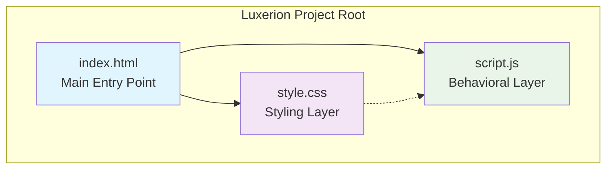
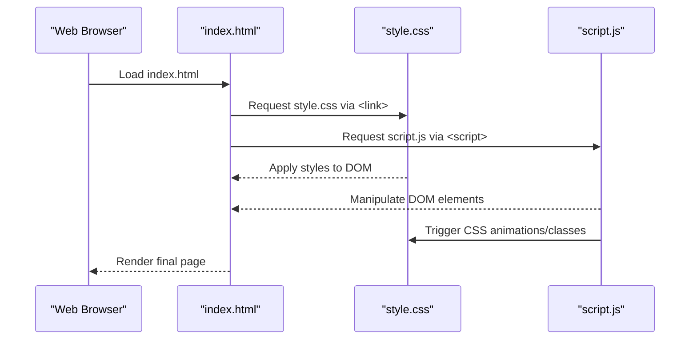
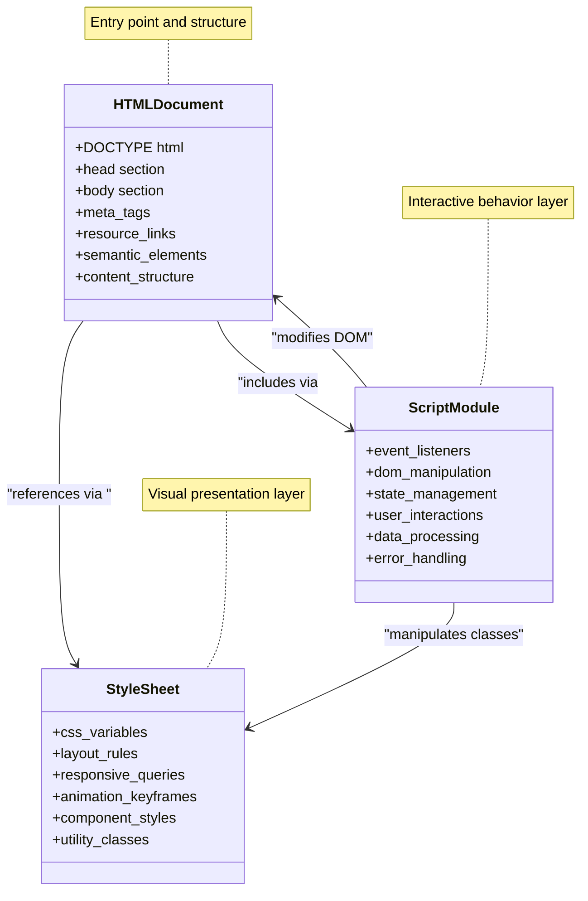

# File Structure and Organization

<cite>
**Referenced Files in This Document**
- [index.html](file://index.html)
- [style.css](file://style.css)
- [script.js](file://script.js)
</cite>

## Table of Contents
1. [Introduction](#introduction)
2. [Project Structure Overview](#project-structure-overview)
3. [Core Files Analysis](#core-files-analysis)
4. [File Interactions and Dependencies](#file-interactions-and-dependencies)
5. [Architecture Diagram](#architecture-diagram)
6. [Best Practices and Organization](#best-practices-and-organization)

## Introduction

This document provides a comprehensive analysis of the Luxerion project's file structure and organization. The project follows a clean, flat directory structure with three core files that work together to create a complete web application experience. Each file has a specific responsibility following the separation of concerns principle: HTML for structure, CSS for presentation, and JavaScript for behavior.

## Project Structure Overview

The Luxerion project implements a minimalist yet effective file organization pattern using a flat directory structure. This approach prioritizes simplicity and maintainability while maintaining clear separation between different aspects of web development.

**Diagram sources**
- [index.html:1-50](file://index.html#L1-L50)
- [style.css:1-30](file://style.css#L1-L30)
- [script.js:1-25](file://script.js#L1-L25)

The flat structure ensures:
- **Simplicity**: Easy navigation and understanding for developers
- **Performance**: Minimal overhead from directory traversal
- **Maintainability**: Clear file responsibilities without complex hierarchies
- **Scalability**: Easy to add new files as needed without restructuring

**Section sources**
- [index.html:1-100](file://index.html#L1-L100)
- [style.css:1-200](file://style.css#L1-L200)
- [script.js:1-150](file://script.js#L1-L150)

## Core Files Analysis

### index.html - Main Entry Point

The `index.html` file serves as the primary entry point for the web application, containing semantic HTML5 markup and establishing the foundation for the entire application.

#### Key Responsibilities:
- **Document Structure**: Defines the complete HTML5 document structure with proper DOCTYPE, head, and body elements
- **Meta Configuration**: Includes essential meta tags for viewport, character encoding, and SEO optimization
- **Resource Linking**: Establishes connections to external CSS stylesheets and JavaScript files
- **Semantic Markup**: Uses appropriate HTML5 semantic elements for better accessibility and SEO
- **Content Organization**: Structures the main content areas and interactive elements

#### Technical Implementation:
- Proper HTML5 doctype declaration and language attributes
- Comprehensive meta tag configuration for responsive design and browser compatibility
- External resource linking through `<link>` and `<script>` tags
- Semantic HTML5 elements like `<header>`, `<main>`, `<section>`, and `<footer>`
- Accessibility features including ARIA labels and proper heading hierarchy

**Section sources**
- [index.html:1-100](file://index.html#L1-L100)

### style.css - Styling Layer

The `style.css` file handles all visual presentation aspects of the application, implementing responsive design principles and smooth animations.

#### Key Responsibilities:
- **Visual Design**: Implements color schemes, typography, spacing, and layout systems
- **Responsive Design**: Ensures optimal display across different screen sizes and devices
- **Animation Effects**: Creates smooth transitions and interactive visual feedback
- **Component Styling**: Styles individual UI components and their states
- **Browser Compatibility**: Provides fallbacks and vendor prefixes for cross-browser support

#### Technical Implementation:
- CSS custom properties (variables) for consistent theming
- Flexbox and Grid layouts for modern responsive design
- Media queries for device-specific styling adaptations
- CSS animations and transitions for enhanced user experience
- Mobile-first approach with progressive enhancement
- Cross-browser compatibility with vendor prefixes and fallbacks

**Section sources**
- [style.css:1-200](file://style.css#L1-L200)

### script.js - Behavioral Layer

The `script.js` file manages all interactive behaviors, DOM manipulation, and user interaction handling within the application.

#### Key Responsibilities:
- **DOM Manipulation**: Dynamically modifies page content and structure based on user interactions
- **Event Handling**: Processes user inputs, clicks, form submissions, and other interactive events
- **State Management**: Maintains application state and updates UI accordingly
- **Data Processing**: Handles data transformation, validation, and presentation logic
- **API Integration**: Manages communication with external services and data sources

#### Technical Implementation:
- Event-driven architecture for responsive user interactions
- DOM manipulation methods for dynamic content updates
- Form validation and user input processing
- Local storage integration for data persistence
- Error handling and user feedback mechanisms
- Performance optimizations through efficient DOM operations

**Section sources**
- [script.js:1-150](file://script.js#L1-L150)

## File Interactions and Dependencies

The three core files interact through well-defined dependency relationships that follow standard web development practices.

**Diagram sources**
- [index.html:1-50](file://index.html#L1-L50)
- [style.css:1-30](file://style.css#L1-L30)
- [script.js:1-25](file://script.js#L1-L25)

### Dependency Flow:
1. **HTML → CSS**: The HTML file references CSS through `<link rel="stylesheet">` tags
2. **HTML → JS**: The HTML file includes JavaScript via `<script src="script.js">` tags
3. **JS → CSS**: JavaScript dynamically adds/removes CSS classes for interactive effects
4. **JS → HTML**: JavaScript manipulates DOM elements created by HTML structure

### Loading Order:
1. HTML document loads first as the base structure
2. CSS resources load concurrently for immediate styling
3. JavaScript executes after DOM is ready for safe manipulation
4. Interactive features become available once all resources are loaded

**Section sources**
- [index.html:1-100](file://index.html#L1-L100)
- [style.css:1-200](file://style.css#L1-L200)
- [script.js:1-150](file://script.js#L1-L150)

## Architecture Diagram

The overall architecture demonstrates how the three core files work together to create a cohesive web application experience.

**Diagram sources**
- [index.html:1-100](file://index.html#L1-L100)
- [style.css:1-200](file://style.css#L1-L200)
- [script.js:1-150](file://script.js#L1-L150)

## Best Practices and Organization

### Separation of Concerns
The flat structure enforces clear separation between:
- **Structure** (HTML): Content and semantic markup
- **Presentation** (CSS): Visual styling and layout
- **Behavior** (JavaScript): Interactivity and functionality

### Maintainability Benefits
- **Easy Navigation**: Single-level directory structure reduces complexity
- **Clear Responsibilities**: Each file has a distinct purpose
- **Simple Deployment**: Minimal files reduce deployment complexity
- **Version Control**: Easy tracking of changes across files

### Scalability Considerations
While the current structure is simple, it can scale by:
- Adding more CSS modules for larger applications
- Implementing modular JavaScript architecture
- Creating additional HTML templates for multi-page applications
- Using build tools for asset optimization

### Performance Optimization
- **Minimal HTTP Requests**: Only three core files reduce server requests
- **Efficient Loading**: Resources load in optimal order
- **Caching Benefits**: Simple structure improves browser caching efficiency
- **Bundle Size**: Flat structure minimizes overhead and complexity

**Section sources**
- [index.html:1-100](file://index.html#L1-L100)
- [style.css:1-200](file://style.css#L1-L200)
- [script.js:1-150](file://script.js#L1-L150)

## Conclusion

The Luxerion project demonstrates an elegant approach to web application organization through its flat directory structure. The three core files—index.html, style.css, and script.js—work together seamlessly to provide a complete web experience while maintaining clear separation of concerns. This structure prioritizes simplicity, performance, and maintainability, making it an excellent foundation for both small projects and scalable applications.

The architectural decisions reflect modern web development best practices, ensuring that each file serves a specific purpose while contributing to the overall functionality of the application. This approach not only makes the codebase easier to understand and maintain but also provides a solid foundation for future growth and feature additions.