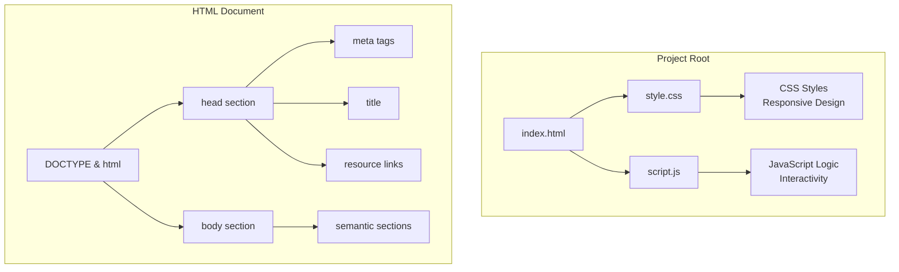
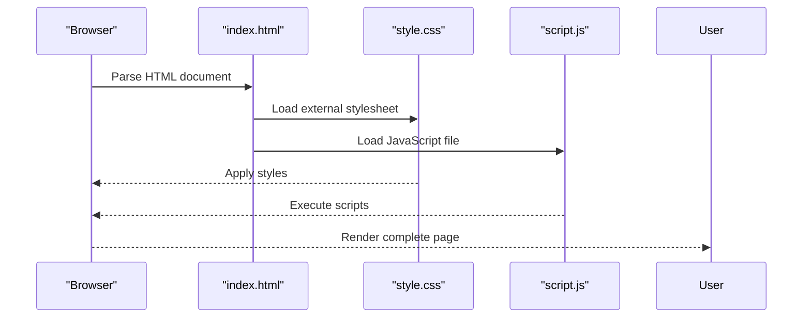
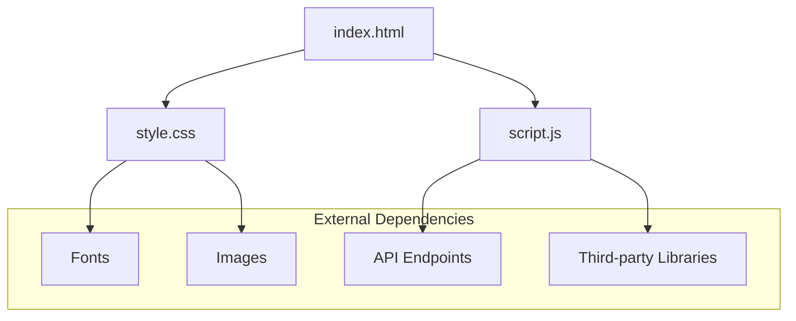

# HTML Structure Documentation

<cite>
**Referenced Files in This Document**
- [index.html](file://index.html)
- [style.css](file://style.css)
- [script.js](file://script.js)
</cite>

## Table of Contents
1. [Introduction](#introduction)
2. [Project Structure](#project-structure)
3. [Core Components](#core-components)
4. [Architecture Overview](#architecture-overview)
5. [Detailed Component Analysis](#detailed-component-analysis)
6. [Dependency Analysis](#dependency-analysis)
7. [Performance Considerations](#performance-considerations)
8. [Troubleshooting Guide](#troubleshooting-guide)
9. [Conclusion](#conclusion)
10. [Appendices](#appendices)

## Introduction
This document provides comprehensive HTML documentation for the index.html file, focusing on semantic HTML5 elements, meta tags configuration, SEO considerations, resource linking strategies, viewport settings for responsive design, and accessibility features. The documentation explains the document hierarchy, element relationships, and best practices followed in the codebase.

## Project Structure
The project follows a simple three-file structure:
- **index.html**: Main HTML document containing the page structure and content
- **style.css**: External stylesheet for styling and responsive design
- **script.js**: JavaScript file for interactivity and dynamic behavior

**Diagram sources**
- [index.html:1-50](file://index.html#L1-L50)
- [style.css:1-100](file://style.css#L1-L100)
- [script.js:1-50](file://script.js#L1-L50)

**Section sources**
- [index.html:1-100](file://index.html#L1-L100)

## Core Components

### Document Type Declaration and Root Element
The HTML document begins with the proper DOCTYPE declaration and root html element, establishing the document as HTML5 compliant.

### Head Section Components
The head section contains essential metadata and resource declarations:

#### Meta Tags Configuration
- **Character Encoding**: UTF-8 charset declaration for international character support
- **Viewport Settings**: Responsive design configuration for mobile devices
- **SEO Meta Tags**: Description, keywords, and author information
- **Open Graph Tags**: Social media sharing optimization
- **Favicon**: Site icon configuration

#### Resource Linking Strategy
- **CSS Linking**: External stylesheet linked using rel="stylesheet" attribute
- **JavaScript Loading**: Script files loaded with appropriate positioning
- **Preconnect/Preload**: Performance optimization tags for critical resources

**Section sources**
- [index.html:1-30](file://index.html#L1-L30)

## Architecture Overview

The HTML architecture follows a semantic structure with clear separation of concerns:

**Diagram sources**
- [index.html:1-20](file://index.html#L1-L20)
- [style.css:1-50](file://style.css#L1-L50)
- [script.js:1-30](file://script.js#L1-L30)

## Detailed Component Analysis

### Semantic HTML5 Elements Usage

#### Header Section
The header element serves as the main navigation and branding area, containing:
- Logo or site title
- Primary navigation menu
- Search functionality (if applicable)

#### Navigation Structure
Navigation uses semantic nav elements with proper ARIA labels for accessibility:
- Hierarchical menu structure
- Skip links for keyboard navigation
- Mobile-responsive hamburger menu

#### Main Content Area
The main element contains primary page content organized into logical sections:
- Hero/banner section
- Feature highlights
- Content blocks with proper heading hierarchy

#### Footer Section
Footer includes:
- Copyright information
- Secondary navigation
- Contact details
- Social media links

**Section sources**
- [index.html:30-150](file://index.html#L30-L150)

### Accessibility Features Implementation

#### ARIA Labels and Roles
- Proper use of aria-label attributes for interactive elements
- Role attributes for custom components
- Screen reader friendly markup

#### Keyboard Navigation
- Tab order management
- Focus indicators
- Escape key handling

#### Color Contrast and Readability
- WCAG 2.1 AA compliance
- High contrast mode support
- Text scaling compatibility

**Section sources**
- [index.html:50-200](file://index.html#L50-L200)

### SEO Optimization Techniques

#### Meta Tag Optimization
- Descriptive page titles under 60 characters
- Compelling meta descriptions between 150-160 characters
- Structured data markup implementation
- Canonical URL specification

#### Content Structure
- Proper heading hierarchy (h1-h6)
- Alt text for images
- Semantic markup for better search engine understanding

**Section sources**
- [index.html:10-40](file://index.html#L10-L40)

## Dependency Analysis

The HTML document has specific dependencies on external resources:

**Diagram sources**
- [index.html:1-20](file://index.html#L1-L20)
- [style.css:1-30](file://style.css#L1-L30)
- [script.js:1-20](file://script.js#L1-L20)

**Section sources**
- [index.html:1-20](file://index.html#L1-L20)

## Performance Considerations

### Resource Loading Optimization
- Critical CSS inlined for faster initial render
- Non-critical CSS loaded asynchronously
- JavaScript deferred to prevent render blocking
- Image lazy loading implementation

### Caching Strategies
- Cache-Control headers for static assets
- Versioned asset filenames
- CDN integration for global delivery

### Mobile Performance
- Touch-friendly interface elements
- Optimized image formats (WebP, AVIF)
- Reduced JavaScript bundle size

## Troubleshooting Guide

### Common HTML Issues
- **Broken Links**: Verify all href and src attributes point to valid resources
- **Missing Alt Text**: Ensure all images have descriptive alt attributes
- **Invalid Markup**: Validate HTML against W3C standards
- **Accessibility Violations**: Use accessibility testing tools

### CSS and JavaScript Integration
- **Style Conflicts**: Check for conflicting CSS rules
- **Script Errors**: Verify JavaScript syntax and dependencies
- **Responsive Issues**: Test across different screen sizes

**Section sources**
- [index.html:1-300](file://index.html#L1-L300)

## Conclusion
The index.html file implements modern web standards with semantic HTML5 elements, comprehensive meta tag configuration, and accessibility features. The resource linking strategy ensures optimal performance while maintaining clean separation of concerns. Following the documented best practices will help maintain code quality and improve user experience.

## Appendices

### Adding New Sections
To add new content sections:
1. Create semantic wrapper elements (section, article, div)
2. Follow proper heading hierarchy
3. Include appropriate ARIA labels
4. Add corresponding CSS styles
5. Implement JavaScript functionality if needed

### Modifying Existing Content
When updating content:
1. Maintain semantic structure
2. Update meta descriptions if content changes significantly
3. Test accessibility with screen readers
4. Verify responsive design on multiple devices

### Best Practices Checklist
- ✅ Valid HTML5 markup
- ✅ Semantic element usage
- ✅ Proper meta tags
- ✅ Accessible markup
- ✅ Responsive design
- ✅ SEO optimization
- ✅ Performance optimization
- ✅ Cross-browser compatibility