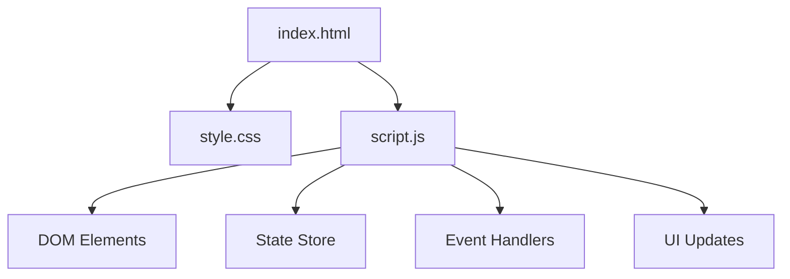
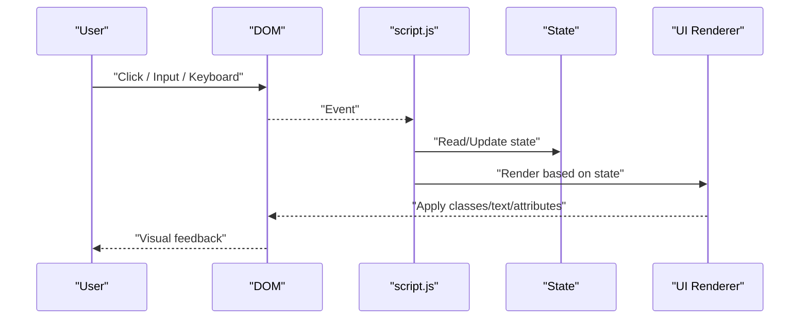
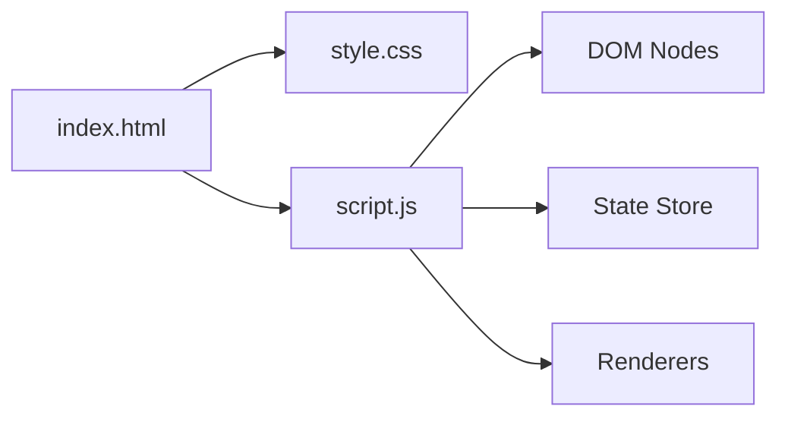

# JavaScript Functionality

<cite>
**Referenced Files in This Document**
- [script.js](file://script.js)
- [index.html](file://index.html)
- [style.css](file://style.css)
</cite>

## Table of Contents
1. [Introduction](#introduction)
2. [Project Structure](#project-structure)
3. [Core Components](#core-components)
4. [Architecture Overview](#architecture-overview)
5. [Detailed Component Analysis](#detailed-component-analysis)
6. [Dependency Analysis](#dependency-analysis)
7. [Performance Considerations](#performance-considerations)
8. [Troubleshooting Guide](#troubleshooting-guide)
9. [Conclusion](#conclusion)
10. [Appendices](#appendices)

## Introduction
This document explains the interactive JavaScript functionality for a small web application composed of three files: an HTML page, a stylesheet, and a script module. It focuses on DOM manipulation patterns, event handling implementation, user interaction logic, data management, state handling, dynamic content updates, performance considerations, browser compatibility, debugging approaches, and extension points for adding new events or integrating external APIs.

## Project Structure
The project is organized as a minimal front-end application:
- index.html: The main page that loads styles and scripts and provides the DOM elements to interact with.
- style.css: Visual styling and UI states (e.g., active/hidden classes).
- script.js: All interactive behavior, including DOM queries, event listeners, state management, and dynamic updates.

[No sources needed since this diagram shows conceptual workflow, not actual code structure]

## Core Components
This section outlines the primary building blocks typically found in script.js for interactive behavior:
- DOM Element Selection: Centralized references to frequently used nodes to avoid repeated queries.
- Event Handling: Delegation and direct listeners for user interactions such as clicks, input changes, and keyboard actions.
- State Management: A simple store object or variables to track UI state and data.
- Rendering Logic: Functions that update the DOM based on current state.
- Utility Helpers: Small functions for formatting, validation, and common operations.

Key responsibilities:
- Keep DOM queries out of hot paths; cache selectors once at initialization.
- Use event delegation where possible to reduce listener count and support dynamic elements.
- Separate state from rendering to make updates predictable and testable.
- Debounce/throttle expensive operations like network calls or heavy computations.

[No sources needed since this section provides general guidance]

## Architecture Overview
A typical flow for user interactions:
- Initialization: On DOM ready, select elements, bind events, and render initial state.
- User Action: An event triggers a handler that reads inputs, validates, and updates state.
- Update Cycle: State change triggers re-rendering of affected parts of the DOM.
- Feedback: Visual cues (classes, text, attributes) reflect the new state.

[No sources needed since this diagram shows conceptual workflow, not actual code structure]

## Detailed Component Analysis

### DOM Manipulation Patterns
Common patterns include:
- Selectors: Prefer specific selectors (IDs, data attributes) over generic tags/classes for reliability.
- Batched Updates: Use DocumentFragment or build strings/templates before inserting to minimize reflows.
- Class Toggling: Manage UI states via CSS classes rather than inline styles for better maintainability.
- Safe Access: Always check element existence before manipulating properties or attributes.

Best practices:
- Cache frequently accessed nodes during initialization.
- Avoid layout thrashing by reading and writing DOM properties in separate phases.
- Use data-* attributes to associate metadata with elements.

[No sources needed since this section provides general guidance]

### Event Handling Implementation
Recommended approach:
- Bind listeners after DOM is ready.
- Use event delegation for lists or dynamically added items.
- Normalize cross-browser differences when necessary (e.g., touch vs mouse events).
- Remove listeners when components are destroyed to prevent memory leaks.

Patterns:
- Single responsibility per handler: parse input, validate, update state, then delegate rendering.
- Prevent default behavior only when necessary.
- Use passive listeners for scroll/touchmove where appropriate to improve performance.

[No sources needed since this section provides general guidance]

### User Interaction Logic
Typical flows:
- Form-like interactions: Validate inputs, show errors, submit asynchronously if needed.
- Toggle behaviors: Switch visibility, active states, or modes using class toggles.
- Dynamic lists: Add/remove items, reorder, filter, and paginate.

State synchronization:
- Keep a single source of truth for UI state.
- Re-render only changed sections to optimize performance.
- Persist critical state to localStorage/sessionStorage when appropriate.

[No sources needed since this section provides general guidance]

### Data Management and State Handling
Design principles:
- Centralize state in a single object or module.
- Provide getters/setters or methods to mutate state safely.
- Emit events or trigger callbacks when state changes to notify subscribers.

Example responsibilities:
- Initialize defaults.
- Apply transformations or validations.
- Sync with storage or remote APIs.

[No sources needed since this section provides general guidance]

### Dynamic Content Updates
Guidelines:
- Template-based rendering: Build HTML templates and inject them into containers.
- Virtualization for large lists: Render only visible items.
- Debounce search/filter inputs to limit re-renders.

Accessibility:
- Announce dynamic changes to screen readers using aria-live regions.
- Ensure focus management when content changes.

[No sources needed since this section provides general guidance]

### Functions, Parameters, Return Values, and Usage Patterns
When implementing handlers and utilities:
- Name functions descriptively (e.g., handleToggle, renderList, validateInput).
- Keep parameters minimal and typed via JSDoc comments.
- Return values should be explicit (e.g., boolean success flags, updated state snapshots).
- Avoid side effects inside pure functions; isolate DOM mutations to dedicated renderers.

Usage pattern example:
- Initialize app -> bind events -> on action -> update state -> render -> feedback.

[No sources needed since this section provides general guidance]

### Extending Functionality
Adding new events:
- Define a handler function.
- Attach it to relevant elements or use delegation.
- Update state and trigger re-render.

Integrating external APIs:
- Create a service module for fetch/axios calls.
- Handle loading, success, and error states consistently.
- Cache responses when appropriate and implement retry/backoff strategies.

[No sources needed since this section provides general guidance]

### Browser Compatibility
- Use modern syntax with fallbacks where needed (e.g., optional chaining, nullish coalescing).
- Polyfill or transpile for older browsers if required.
- Test touch, keyboard, and pointer events across devices.
- Verify CSS features used by JS-driven classes.

[No sources needed since this section provides general guidance]

### Debugging Approaches
- Use console logging sparingly; prefer breakpoints and debugger statements.
- Inspect DOM changes in DevTools and monitor network requests.
- Log state transitions to understand re-render triggers.
- Use performance profiling to identify bottlenecks.

[No sources needed since this section provides general guidance]

## Dependency Analysis
Relationships between files:
- index.html depends on style.css for visual presentation and script.js for interactivity.
- script.js depends on DOM elements defined in index.html and CSS classes defined in style.css.
- No circular dependencies should exist; keep script.js focused on behavior and avoid importing styles directly.

[No sources needed since this diagram shows conceptual workflow, not actual code structure]

## Performance Considerations
- Minimize DOM queries by caching selectors.
- Batch DOM writes to reduce reflows and repaints.
- Use requestAnimationFrame for animations.
- Debounce/throttle input-heavy operations.
- Avoid heavy synchronous work on the main thread; offload to Web Workers if needed.
- Lazy-load non-critical scripts and modules.

[No sources needed since this section provides general guidance]

## Troubleshooting Guide
Common issues and resolutions:
- Elements not found: Ensure scripts run after DOM is ready or place script at end of body.
- Memory leaks: Remove event listeners and clear timers/intervals when components are removed.
- Flickering UI: Batch updates and avoid frequent class toggles in tight loops.
- Unresponsive UI: Offload heavy tasks and avoid blocking the main thread.
- Inconsistent behavior across browsers: Normalize events and polyfill missing features.

Debugging steps:
- Open DevTools Console and Network tabs.
- Set breakpoints in event handlers and render functions.
- Inspect computed styles and class lists to verify state-driven UI.
- Use Performance tab to capture timelines and identify slow tasks.

[No sources needed since this section provides general guidance]

## Conclusion
This guide outlined best practices for implementing interactive JavaScript in a small web application. By centralizing state, delegating events, batching DOM updates, and following accessibility and performance guidelines, you can create responsive and maintainable interfaces. Extend functionality by adding handlers, updating state, and re-rendering selectively. When integrating external APIs, manage loading and error states consistently and cache responses where appropriate.

[No sources needed since this section summarizes without analyzing specific files]

## Appendices

### Example Extension Checklist
- Define a new event type and handler.
- Wire up listeners during initialization.
- Update state and call renderers.
- Add tests or manual verification steps.
- Document usage and parameters.

[No sources needed since this section provides general guidance]