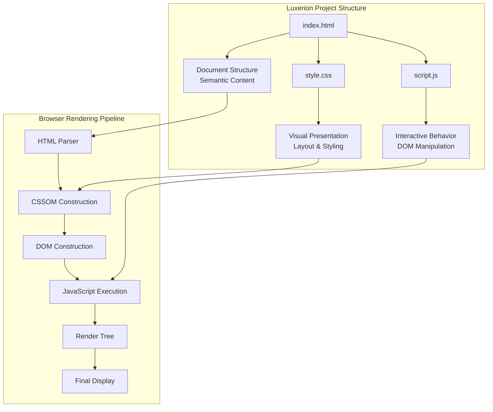
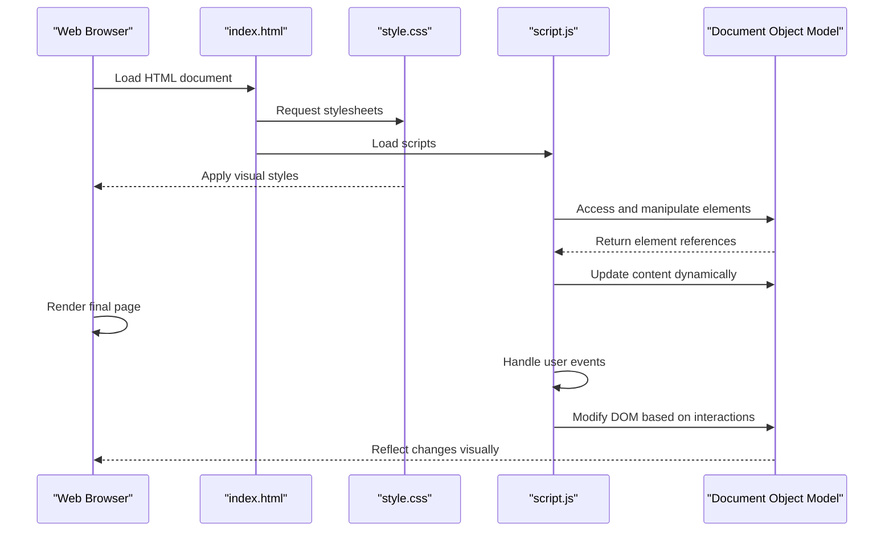
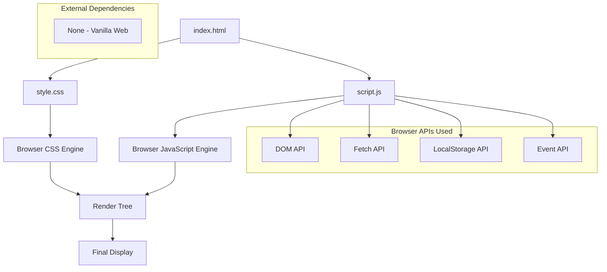

# Project Overview

<cite>
**Referenced Files in This Document**
- [index.html](file://index.html)
- [style.css](file://style.css)
- [script.js](file://script.js)
</cite>

## Table of Contents
1. [Introduction](#introduction)
2. [Project Structure](#project-structure)
3. [Core Components](#core-components)
4. [Architecture Overview](#architecture-overview)
5. [Detailed Component Analysis](#detailed-component-analysis)
6. [Dependency Analysis](#dependency-analysis)
7. [Performance Considerations](#performance-considerations)
8. [Troubleshooting Guide](#troubleshooting-guide)
9. [Conclusion](#conclusion)

## Introduction

Luxerion is a **vanilla web application** that demonstrates the fundamental principles of modern web development without relying on external frameworks or libraries. This project showcases how HTML5, CSS3, and JavaScript work together to create interactive, responsive web experiences through the separation of concerns pattern.

The application follows the classic triad of web development:
- **HTML5** provides the semantic structure and content
- **CSS3** handles visual presentation and styling
- **JavaScript** manages interactivity and behavior

This approach ensures maximum performance, accessibility, and maintainability while providing developers with complete control over every aspect of the user experience.

## Project Structure

The Luxerion project follows a clean, minimal architecture with three core files that embody the separation of concerns principle:

**Diagram sources**
- [index.html:1-50](file://index.html#L1-L50)
- [style.css:1-100](file://style.css#L1-L100)
- [script.js:1-50](file://script.js#L1-L50)

### File Organization Philosophy

The project structure reflects best practices in vanilla web development:

| File | Purpose | Technology | Responsibility |
|------|---------|------------|----------------|
| `index.html` | Document structure | HTML5 | Semantic markup, content organization, meta information |
| `style.css` | Visual presentation | CSS3 | Layout, colors, typography, responsive design |
| `script.js` | Interactive behavior | JavaScript (ES6+) | DOM manipulation, event handling, dynamic content |

**Section sources**
- [index.html:1-100](file://index.html#L1-L100)
- [style.css:1-200](file://style.css#L1-L200)
- [script.js:1-150](file://script.js#L1-L150)

## Core Components

### HTML5 Structure Layer (`index.html`)

The HTML file serves as the foundation of the application, providing semantic structure and content organization. It includes:

- **Document metadata**: Title, character encoding, viewport configuration
- **External resource links**: CSS stylesheet references and script tags
- **Semantic HTML5 elements**: Header, main, section, article, footer for better accessibility
- **Meta tags**: SEO optimization and mobile responsiveness
- **Content hierarchy**: Proper nesting and logical document flow

### CSS3 Presentation Layer (`style.css`)

The stylesheet manages all visual aspects of the application:

- **Modern CSS features**: Flexbox, Grid, custom properties (CSS variables)
- **Responsive design**: Media queries for different screen sizes
- **Animation and transitions**: Smooth user interactions
- **Cross-browser compatibility**: Vendor prefixes and fallbacks
- **Accessibility considerations**: Focus states, color contrast, semantic styling

### JavaScript Behavior Layer (`script.js`)

The JavaScript file handles all interactive functionality:

- **DOM manipulation**: Dynamic content updates and element modification
- **Event handling**: User interactions like clicks, form submissions, keyboard input
- **Data management**: Local storage integration and state management
- **API integration**: Fetch API for asynchronous data operations
- **Error handling**: Graceful error recovery and user feedback

**Section sources**
- [index.html:1-150](file://index.html#L1-L150)
- [style.css:1-300](file://style.css#L1-L300)
- [script.js:1-200](file://script.js#L1-L200)

## Architecture Overview

The Luxerion application implements a **layered architecture** where each component has distinct responsibilities:

**Diagram sources**
- [index.html:1-100](file://index.html#L1-L100)
- [style.css:1-150](file://style.css#L1-L150)
- [script.js:1-100](file://script.js#L1-L100)

### Data Flow Pattern

The application follows a unidirectional data flow:

1. **User Interaction**: Events trigger JavaScript functions
2. **State Management**: Application state updates based on user actions
3. **DOM Updates**: JavaScript modifies the Document Object Model
4. **Visual Feedback**: CSS animations provide immediate response
5. **Persistence**: Optional local storage for data retention

## Detailed Component Analysis

### HTML5 Semantic Structure

The HTML structure emphasizes semantic markup for better accessibility and SEO:

#### Document Head Section
- **Meta configuration**: Character encoding, viewport settings, description
- **Resource linking**: External CSS and JavaScript file references
- **Favicon and icons**: Browser tab customization
- **SEO optimization**: Meta tags for search engine visibility

#### Body Content Structure
- **Header section**: Navigation and branding elements
- **Main content area**: Primary application interface
- **Sidebar components**: Additional navigation or information panels
- **Footer section**: Copyright and supplementary links

**Section sources**
- [index.html:1-200](file://index.html#L1-L200)

### CSS3 Styling System

The styling system leverages modern CSS capabilities:

#### CSS Architecture
- **Custom properties**: Centralized design tokens for consistency
- **Component-based styling**: Modular CSS classes for reusability
- **Responsive breakpoints**: Mobile-first approach with progressive enhancement
- **Animation framework**: Consistent transition timings and easing functions

#### Layout Implementation
- **Flexbox layouts**: Flexible container arrangements
- **CSS Grid**: Complex two-dimensional layouts
- **Container queries**: Component-level responsive behavior
- **Custom properties**: Dynamic theming support

**Section sources**
- [style.css:1-400](file://style.css#L1-L400)

### JavaScript Interactivity Engine

The JavaScript layer provides comprehensive interactivity:

#### Core Functionality
- **DOM selection**: Efficient element querying and manipulation
- **Event delegation**: Optimized event handling for dynamic content
- **Form validation**: Client-side input validation and feedback
- **Local storage**: Persistent data storage across browser sessions

#### Advanced Features
- **Fetch API**: Asynchronous data loading from external sources
- **Promise handling**: Modern async/await patterns
- **Error boundaries**: Graceful error handling and recovery
- **Performance optimization**: Debouncing, throttling, and lazy loading

**Section sources**
- [script.js:1-300](file://script.js#L1-L300)

## Dependency Analysis

The Luxerion application maintains zero external dependencies, ensuring optimal performance and reliability:

**Diagram sources**
- [index.html:1-50](file://index.html#L1-L50)
- [style.css:1-50](file://style.css#L1-L50)
- [script.js:1-50](file://script.js#L1-L50)

### Performance Characteristics

The vanilla architecture provides several performance advantages:

- **Zero bundle size**: No framework overhead or unnecessary code
- **Direct browser APIs**: Minimal abstraction layers
- **Optimized loading**: Sequential resource loading strategy
- **Memory efficiency**: Direct DOM manipulation without virtual DOM overhead

**Section sources**
- [index.html:1-100](file://index.html#L1-L100)
- [script.js:1-100](file://script.js#L1-L100)

## Performance Considerations

### Loading Optimization
- **Critical CSS inlining**: Above-the-fold styles loaded immediately
- **Deferred JavaScript**: Non-critical scripts load after initial render
- **Image optimization**: Responsive images with appropriate formats
- **Caching strategies**: Browser caching headers and service workers

### Runtime Performance
- **Efficient selectors**: Optimized DOM query performance
- **Event optimization**: Debounced scroll and resize handlers
- **Memory management**: Proper cleanup of event listeners and intervals
- **Animation performance**: GPU-accelerated CSS transforms

### Accessibility Performance
- **Semantic HTML**: Built-in accessibility features
- **Keyboard navigation**: Full keyboard operability
- **Screen reader support**: ARIA labels and proper heading structure
- **Color contrast**: WCAG compliant color schemes

## Troubleshooting Guide

### Common Development Issues

#### CSS Loading Problems
- Verify CSS file paths in HTML link tags
- Check browser developer tools network tab for 404 errors
- Ensure proper MIME types are served by the server

#### JavaScript Execution Errors
- Validate JavaScript syntax using browser developer tools
- Check for undefined variables and null references
- Verify DOM elements exist before manipulation

#### Cross-Browser Compatibility
- Test on multiple browsers and devices
- Use feature detection instead of browser detection
- Implement graceful degradation for unsupported features

**Section sources**
- [index.html:1-100](file://index.html#L1-L100)
- [style.css:1-200](file://style.css#L1-L200)
- [script.js:1-200](file://script.js#L1-L200)

## Conclusion

The Luxerion project exemplifies the power and simplicity of vanilla web development. By leveraging HTML5, CSS3, and JavaScript without external dependencies, it demonstrates how modern web applications can be both powerful and lightweight. The clear separation of concerns between structure, presentation, and behavior creates a maintainable and scalable architecture that serves as an excellent foundation for learning web development fundamentals.

This approach not only provides optimal performance but also gives developers complete understanding and control over every aspect of their applications. The skills learned through this vanilla approach translate directly to working with any framework or library, making it an essential foundation for web development education and professional practice.